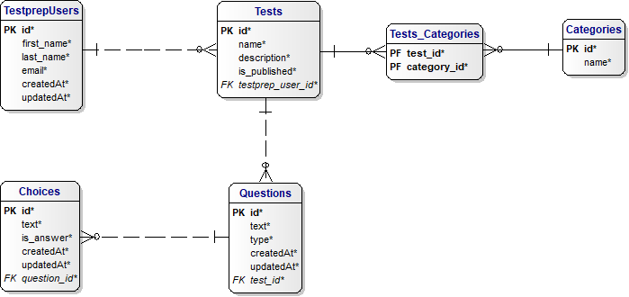

# TESTPREP DJANGO REST API DESIGN

## Table of Contents
<!-- START doctoc generated TOC please keep comment here to allow auto update -->
<!-- DON'T EDIT THIS SECTION, INSTEAD RE-RUN doctoc TO UPDATE -->

- [Motivation](#motivation)
- [Technologies Used](#technologies-used)
- [High Level Entity Design](#high-level-entity-design)
- [ERD](#erd)
- [Data Dictionary](#data-dictionary)
  - [TestprepUser](#testprepuser)
  - [Tests](#tests)
  - [Categories](#categories)
- [API Design](#api-design)
  - [API End Points](#api-end-points)
  - [API JSON Payloads](#api-json-payloads)
- [Testing](#testing)
  - [Integration Testing](#integration-testing)
  - [Unit Testing](#unit-testing)

<!-- END doctoc generated TOC please keep comment here to allow auto update -->

## Motivation  
Besides computer science, one of my passions is foreign language study.

I built a Russian Flashcard app using the MERN stack. While I like this app for acquiring vocabulary,
I wanted something that could also handle grammar. I also coach native Russian speakers in The Russian
Federation via Skype with the English language and accent reduction. I thought that it would also be good
to generate some English grammar tests for them to help them with particular grammatical stumbling blocks.
Flashcards can work for that, but it not in my opinion an optimal solution; flashcards can be great for
simple memory recall, but grammar requires more than simple recall.

I was once taking a class and in the class we used a web application called ["Kahoot!"](https://kahoot.it/).
Playing Kahoot made me realize that this was the way for me to generate the tests that I wanted for 
myself and others. I also learned that "Kahoot!" allows anybody to generate a their own "Kahoot!".

Kahoot has a lot of fancy graphics and animations, but at its core it was a simple "select best answer" type
of test. For an initial version of my application, I wanted to support "select best answer" and "select all that
apply" type answers, but allow the app to be maintainable to support question types that I have yet to envision.

So I built a version of that app on the MERN stack, but I wanted to have an API in my portfolio that also 
uses the Django REST framework. So that is the reason for the existence of this project.

Testprep allows an "author" to create, modify, and delete tests. But the author is not limited to grammar tests.
An author can imagine almost any test topic they choose; trivia; history, computer science, etc. At its core, a test
is simply a collection of questions grouped under a topic. A test may classified under one or more "categories" to
make it easier for test takers to find a test of interest to them. A test can have any number of questions that initially
have "select best" or "select all that apply" answers.

Once a test is created and then published, any user of the Testprep app may choose to take that test.

Future versions of the API would allow users to store test score results, store their language preference, etc. But in the interest of generating a minimal viable product, the design is what you see here.

## Technologies Used
    1. Django
    2. Django REST Framework
    3. Simple JWT
    4. Postgresql

***

## High Level Entity Design

The V1 testprep Django REST API is constrained in order to produce a minimum viable product.

These are the V1 entities:
* TestprepUser / Author (TestprepUser in code; Author in documentation)
* Test
* Question
* Choice
* Category

An author is an ordinary Testprep user who has published a test. 
An author has the self-explanatory attributes "first_name", "last_name", and "email".

A test has a "name" attribute that provides the name of the test, such as "Monty Python Trivia". It also has a
"description" attribute that provides futher information about the test for potential takers of the test. A test
has an "is_published" attribute that is a boolean. If it is true, then the test is considered published and is 
viewable and takeable by any Testprep user. Of course, a test has a foreign key to the author table. In V1 of
the API, a test may only have a single published author.

Each test can have zero or more questions. This can happen when a test is in developement before it is published.
In V1, there is no upper bound for the number of possible questions.

Each question can have zero to N choices. A question may have zero choices due to the fact that an author
may want to first write questions for a test in order to gauge the scope of a test, and then later focus
on choices the choices. A question has a "type" attribute that states whether the question is a "selectBest"
or "selectAll" question. A "selectBest" question is a question that has a single choice. A "selectAll" type
question is a multiple-choice question. This attribute will allow future versions of the API to work with
other question types not yet considered. Each question has a foreign key to the test table, and is therefore
not reusable in other tests.

Each choice has a "text" attribute that is the actual text of the choice. Each choice also has an "is_answer"
property that is true if the choice is an answer to the question. If the question type is "selectBest" then
only one choice may have this attribute set to true. If the question type is "selectAll", then any number
of choices may have this attribute set to true. A "selectAll" question has an additional constraint; at least
one of the choices must be considered "is_answer". Each choice has a foreign key to the Questions table.

There exists also a category. A category may be something such as "trivia", "foreign lanaguage", "computer
science", etc. This forms a many-to-many relationship with a test. A test can have many categories, and a
category may be assigned to multiple tests. There is no requirement that a test be assigned to a category,
or that a category must be assigned to a test. The category exists so as to group tests by some interest.

In V1, only an admin can create, update, and delete categories and that may only be done through the Django
admin site. This is to create a minimal viable product sooner, and category creation should be controlled so
as to keep the number of categories reasonable and manageable.

Most entities also have "createdAt" and "updatedAt" attributes.

All primary and foreign key fields will use surrogate keys since these have the least reason to change.
Because surrogate key fields will be employed, unique constraints will be added to the Django models to
truly ensure uniqueness. This may be relaxed in future versions of the API.

***

## ERD

***

## Data Dictionary  

### TestprepUser  
   
| Attribute    | Data Type                  | Description              | Example(s)                        |    
|--------------|----------------------------|--------------------------|-----------------------------------|    
| `id`         | `integer`                  | `surrogate primary key`  | `1, 2, 1000`                      |    
| `first_name` | `character(max_length=20)` | `author's first name`    | `Scott`, `Jason`, `Jonny`         |    
| `last_name`  | `character(max_length=30)` | `author's last name`     | `Lurowist`, `Humphrey`, `Scharer` |  
| `email`      | `character(max_length=50)` | `author's email`         | `johnsmith@gmail.com`             |   
| `createdAt`  | `datetime field (auto)`    | `date/time of creation`  | `2020-12-08T23:48:58.511578Z`     |    
| `updatedAt`  | `datetime field (auto)`    | `date/time of update`    | `2020-12-08T23:48:58.511578Z`     |  
   
   

### Tests
   
| Attribute      | Data Type                   | Description               | Example(s)                       |  
|--------------- |-----------------------------|---------------------------|-------------------------------|  
| `id`           | `integer`                   | `surrogate primary key`   | `1, 2, 1000`                  |  
| `name`         | `character(max_length=40)`  | `test name`               | `Monty Python Trivia`         |  
| `description`  | `character(max_length=100)` | `test description`        | `Obscure Monty Python Trivia` |
| `is_published` | `boolean`                   | `True if test published`  |                               | 
| `createdAt`    | `datetime field (auto)`     | `date/time of creation`   | `2020-12-08T23:48:58.511578Z` |  
| `updatedAt`    | `datetime field (auto)`     | `date/time of update`     | `2020-12-08T23:48:58.511578Z` |
| `testprep_user_id`| `integer`                   | `surrogate FK to Authors` | `1, 2, 1000`                  |  

   

### Categories
   
| Attribute      | Data Type                   | Description              | Example(s)                       |  
|--------------- |-----------------------------|--------------------------|----------------------------------|  
| `id`           | `integer`                   | `surrogate primary key`  | `1, 2, 1000`                     |  
| `name`         | `character(max_length=40)`  | `category name`          | `Monty Python Trivia`            |  
| `createdAt`    | `datetime field (auto)`     | `date/time of creation`  | `2020-12-08T23:48:58.511578Z`    |  
| `updatedAt`    | `datetime field (auto)`     | `date/time of update`    | `2020-12-08T23:48:58.511578Z`    |

   
   
### Tests_Categories (many-to-many resolution table)
   
| Attribute      | Data Type                   | Description                       | Example(s)            |  
|--------------- |-----------------------------|-----------------------------------|------------------------|  
| `test_id`      | `integer`                   | `surrogate P&F key to Tests`      | `1, 2, 1000`          |  
| `category_id`  | `integer`                   | `surrogate P&F key to Categories` | `1, 2, 1000`         |  
| `createdAt`    | `datetime field (auto)`     | `date/time of creation`           | `2020-12-08T23:48:58.511578Z`|  
| `updatedAt`    | `datetime field (auto)`     | `date/time of update`    | `2020-12-08T23:48:58.511578Z` |  

   
 
### Questions
   
| Attribute      | Data Type                   | Description              | Example(s)                    |  
|--------------- |-----------------------------|--------------------------|-------------------------------|  
| `id`           | `integer`                   | `surrogate PK`           | `1, 2, 1000`                  |  
| `text`         | `character(max_length=200)` | `the actual question`    | `What is a decorator?`        |  
| `type`         | `character(max_length=10)`  | `single or mult choice`  | `selectBest, selectAll`       |
| `createdAt`    | `datetime field (auto)`     | `date/time of creation`  | `2020-12-08T23:48:58.511578Z` |  
| `updatedAt`    | `datetime field (auto)`     | `date/time of update`    | `2020-12-08T23:48:58.511578Z` |
| `test_id`      | `integer`                   | `surrogate FK to Tests`  | `1, 2, 1000`                  |    

   
  
### Choices
   
| Attribute      | Data Type                   | Description              | Example(s)                    |  
|--------------- |-----------------------------|--------------------------|-------------------------------|  
| `id`           | `integer`                   | `surrogate PK`                    | `1, 2, 1000`                  |  
| `text`         | `character(max_length=100)` | `the choice`                      | `A design pattern that...`    |  
| `is_correct`   | `boolean`                   | `True if the choice is an answer` |                      |
| `createdAt`    | `datetime field (auto)`     | `date/time of creation`           | `2020-12-08T23:48:58.511578Z` |  
| `updatedAt`    | `datetime field (auto)`     | `date/time of update`             | `2020-12-08T23:48:58.511578Z` |
| `question_id`  | `integer`                   | `surrogate FK to a question`      | `1, 2, 1000`                  |      

***

## API Design
The API will use a RESTful design, In V1 Tests may be created, updated,
deleted, and destroyed. For a given test, the test as a whole will have CRUD operations
performed on it. That is because it doesn't make much sense to view a question in isolation
of a test, and the same holds true for the choices. It also allows an MVP to be produced faster.

As previously mentioned, authors as really just system users who have published a test. CRUD
operations for authors are done through the authorization endpoints. Categories may only have
CRUD operations performed thorough the Django admin site.

All payloads to and from the API endpoints will be formatted with JSON only.

The Django REST framework will be used to implement the API. Here is an example of how the
directory structure for the API project would look (this is not complete):

Validation will be performed on tests to ensure that if a question is of type "selectBest", that
there is one and only one choice with the attribute "is_answer" set to True. Likewise, if the question
type is "selectAll", then there must be at least one choice with "is_answer" set to True. Any such violation 
would return a 400 error code.

The API will use The Django REST auth framework for authentication and authorization. It will
specifically employ JSON web tokens for authentication since they work on the desktop, web, and mobile devices.
All API calls will be authenticated using JSON web tokens. The only exceptions to this rule would naturally be
the routes for creating an account and logging in. Expired tokens will be blacklisted. Only the access token
may be used to access protected resources. The refresh token is used to obtain a new access token when the current
access token is expired.

Categories may only be manipulated by an administor of the API and for V1 they will be administred through the
Django Admin console. They may be viewed and consumed by any user.

### API End Points

| Verb     | URI Pattern                     | View#Action                              |
|----------|---------------------------------|------------------------------------------|
| POST     | `/api/v1/auth/sign-up/`         | `testprepuser#signup`                    |
| POST     | `/api/v1/auth/sign-in/`         | `testprepuser#signin`                    |
| DELETE   | `/api/v1/auth/sign-out/`        | `testprepuser#signout`                   |
| PATCH    | `/api/v1/auth/change-password/` | `testprepuser#changepw`                  |
| POST     | `/api/v1/auth/token/`           | `returns access and refresh tokens`      |
| POST     | `/api/v1/auth/token/refresh/`   | `returns a new access token`             |
| GET      | `/api/v1/tests/`                | `tests#index of all tests by all authors`|
| GET      | `/api/v1/tests/:id`             | `tests#get a single test`                |
| POST     | `/api/v1/tests/`                | `tests#create a test`                    |
| PATCH    | `/api/v1/tests/:id`             | `tests#update a test`                    |
| DELETE** | `/api/v1/tests/:id`             | `tests#delete a test`                    |
| GET      | `/api/v1/categories/`           | `category#index of all categories`       |
| POST     | `/api/v1/categories/`           | `author#create a category`               |
| PATCH    | `/api/v1/categories/:id`        | `author#update a category`               |
| DELETE   | `/api/v1/categories/:id`        | `tests#delete a category`                |

  * DELETE*   - Causes a cascading delete that deletes all tests and questions and
                choices.
  * DELETE**  - Causes a cascading delete that deletes the test and its questions and
                choices.

All data sent to the API and returned from API actions is formatted as JSON.

### API JSON Payloads

See the [API payloads markdown file](api_payloads.md) for details about JSON payloads.

***

## Testing

### Integration Testing

Integration testing will be performed using Postman. This tool makes it easy to generate
API calls. Each CRUD action listed in the "API Endpoints" table will have an associated 
action in Postman. Postman also has a JavaScript framework that allows for automation of
the tests. V1 will only use Postman for manual testing.

### Unit Testing

Unit testing will employ Pytest and Monkeypatch. V1 will have little to no unit testing 
in order to create an MVP. More study will be needed to understand what can be tested and
what can be faked.

